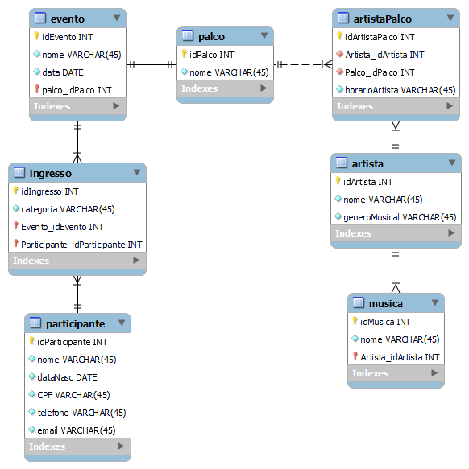
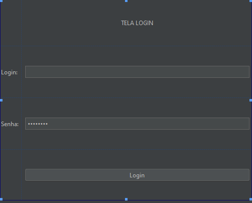
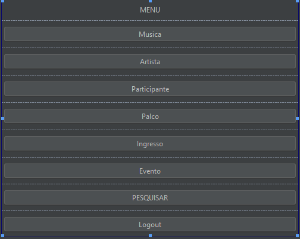
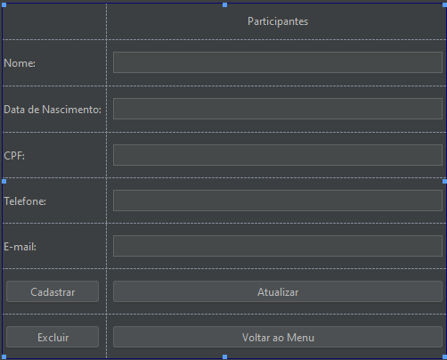
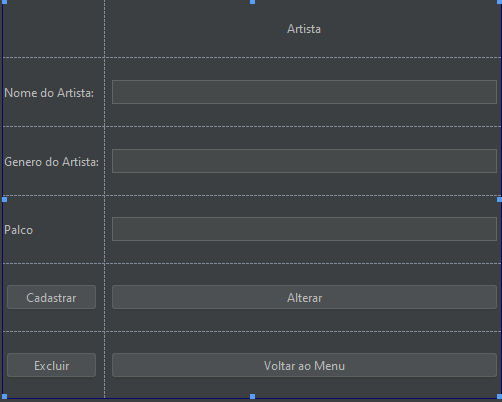
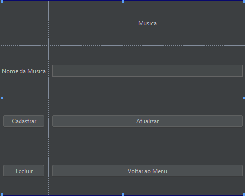
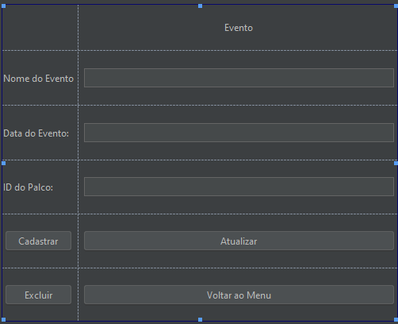
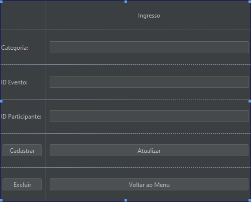
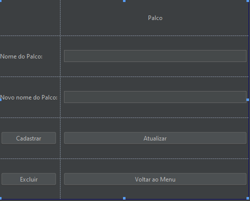

# Engenharia de Software - LAB
[](https://github.com/franlaranjo/C214_L1_Projeto/actions/workflows/main.yml)

## [:computer:] Sobre

- Trabalho de C214-L1
- Orientação: Leonardo Silva de Souza (Leo18ss)
- Equipe: Francielly Marianne Laranjo Silva(franlaranjo) e Phellype Augusto Pereira(phellype4)
- Linguagem de Programação: JAVA
- Projeto desenvolvido para a disciplina de Engenharia de Software do Instituto Nacional de Telecomunicações (INATEL), com propósito de demonstrar os conhecimentos adquiridos durante o semestre
---

## :movie_camera: Demonstração

Para visualizar a demonstração de funcionamento do projeto, [clique aqui](https://github.com/franlaranjo/C214_L1_Projeto/tree/main/Videos)

##

## :hammer: Ferramentas

Antes de começar, você vai precisar ter instalado em sua máquina as seguintes ferramentas:

- [IntelliJ](https://www.jetbrains.com/pt-br/idea/download/#section=windows)
- [MYSQL Workbench](https://dev.mysql.com/downloads/workbench/)
- [Maven](https://maven.apache.org/install.html)

## :warning: Clone

Para clonar o repositório em algum lugar na sua máquina, basta utilizar o comando abaixo:
```bash
$ git clone https://github.com/franlaranjo/C214_L1_Projeto.git
```

## :bulb: Saiba mais

-[CI](https://aws.amazon.com/pt/devops/continuous-integration/)

-[Github Actions](https://github.com/features/actions)

-[Testes Mock](http://www.desenvolvimentoagil.com.br/xp/praticas/tdd/mock_objects): Normalmente criados para testar o comportamento de outros objetos. Em outras palavras, os objetos mock são objetos “falsos” que simulam o comportamento de uma classe ou objeto, permitindo foco na unidade a ser testada.

-[Testes unitários](https://medium.com/assertqualityassurance/teste-unit%C3%A1rio-e-qualidade-de-software-acce7b9c537#:~:text=Testes%20de%20Unidade%20ou%20teste,elas%20estejam%20funcionando%20conforme%20especificado.): É toda a aplicação de teste nas assinaturas de entrada e saída de um sistema. Consiste em validar dados válidos e inválidos.

-[Cypress](https://www.cypress.io): Auxilia o teste de unidade para o FrontEnd.

$npm install cypress ou [Download](https://download.cypress.io/desktop)

## :computer: Telas e Funcionamento

O Software Cadastra Musicas, Participantes, Artistas, Ingressos e Locais para os eventos.
Existem vários eventos e para cada evento, uma venda de ingressos. Tem-se participantes que estarão em cada evento. Além disso, há vários palcos no mesmo evento. Para cada palco é relacionado os artistas que se apresentarão e quais músicas serão reproduzidas.



Com base no Banco de Dados desenvolvido, criou-se as Telas para: 
*[Tela Login](#Tela-Login)

*[Tela Menu](#Tela-Menu)

*[Tela Participante](#Tela-Participante)

*[Tela Artista](#Tela-Artista)

*[Tela Musica](#Tela-Musica)

*[Tela Evento](#Tela-Evento)

*[Tela Ingresso](#Tela-Ingresso)

*[Tela Palco](#Tela-Palco)

*[Tela Pesquisa](#Tela-Pesquisa)

## Tela Login



## Tela Menu



## Tela Participante



## Tela Artista



## Tela Musica



## Tela Evento



## Tela Ingresso



## Tela Palco



## Tela Pesquisa


